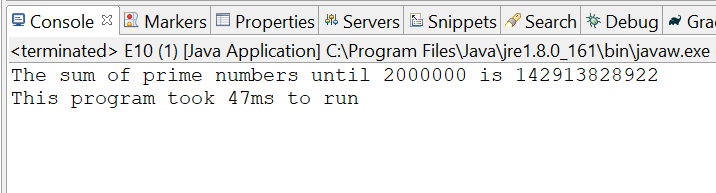

[](https://travis-ci.org/sriram-koushik/project-euler)[](https://codecov.io/gh/sriram-koushik/project-euler)

# Project-euler
Solutions to the problems in the Project Euler problem set (http://projecteuler.net/)

# Quick start
In order to get started and evaluate the solutions there are three approaches
1. Checkout the project and build locally with `gradle build` and run individual classes
2. Download the project, import in an IDE such as Eclipse as gradle project and get it running
3. Download the files in https://github.com/sriram-koushik/project-euler/tree/master/src/main/java and run it locally

# Choosing problems

I had two approaches in choosing the problems. Honestly, this was the most difficult part of the exercise. The first approach I had was selecting problems randomly. I used the following code to randomly choose three problems:

```
import java.util.Random;
public class RandomProblem 
{
    public static void main(String arg[]) 
    {
        int max = 630, min = 10, count = 3;
        Random randObj = new Random();
        for(int index=0;index<count;index++)
            System.out.println(randObj.nextInt((max - min) + 1) + min);
    }
}
```
Then I figured a better approach would be to solve problems that might be relevant to the Adobe Document Cloud team. So with a combination of these two, chose to solve #10, #41 and #118. 

# Coding standards

1). Checkstyle: Used Checkstyle (http://checkstyle.sourceforge.net/) to conform to adhere to an industry coding standard
2). SonarQube: Used SonarQube (https://www.sonarqube.org/) as the static analyzer for the project to identify and fix code smells and vulnerabilities

# Build

This project uses Gradle as means to build the project

# Continuous Integration

This project has TravisCI configured which can build the project everytime a commit is made. This was necessary to run the other analysis scripts, test scripts automatically. We can always see the status of the build based on the latest commit here https://travis-ci.org/sriram-koushik/project-euler and in the badge [](https://travis-ci.org/sriram-koushik/project-euler)


# Quality

Defect Management: 
Using Github issue management to track and fix defects in the system

Tests:
1). Unit tests
2). SonarQube static analyzer tests

Test automation:
All tests are currently automated. The tests are run everytime a commit is made. This is possible via JUnit, TravisCI and gradle scripts.

Quality metrics:
Have used http://codecov.io/ and https://www.eclemma.org/jacoco/ to automatically compute and display the code coverage and other relevant statistics, every commit. The code coverage results can be viewed at https://codecov.io/gh/sriram-koushik/project-euler or in the badge [](https://codecov.io/gh/sriram-koushik/project-euler)

# Configuration Management

Configuration Management usually relates to version management, naming conventions and code branch guidelines. Since this is a simple project with only 1 contributor, we maintain two types of branches:  
master branch - Contains the most stable code
issue#x branch - This issue branch is used to fix a particular issue and then merged with developer upon verifying the test cases
A pull request is made to merge the issue branch to the master branch. This is to add traceability and an easy way to track issues.

# Estimation and Time Spent

The total time spent for the project was tracked via Toggl (http://toggl.com/).The list of tasks are defined below

**Task**|**Estimated**|**Actual**
:-----:|:-----:|:-----:
Problem Selection| 3h| 5h
Gradle setup| 1h| 1h
Travis CI setup| 2h| 1h
JCoCo setup| 1h| 3h
E10 implementation| 2h| 2h
E10 test| 1h| 1.5h
E41 implementation| 3h| 2h
E41 test| 1h| 1.5h
E118 implementation| 2h| 1h
E118 test| .5h| 1h
Integeration| 1h| 1h
SonarQube Integration| 1h| 1h
Bug fixes| 5h| 2h
Readme Markdown writeup| 3h| 4h
**Total**|**30h**|**32h**

# Problem E10
<h2>Description</h2>
  Find the sum of all the primes below two million
  https://projecteuler.net/problem=10

<h2>Sample Output</h2>

<h2>Reasons for choosing this problem</h2> 
Use of prime numbers in Cryptography and encoding is well known. Several cloud services offer ways to encode data before moving files to the cloud and Adobe document cloud embraces the security ideals of Adobe (https://www.adobe.com/security.html). In order to achieve several use cases, one of the core building blocks in generating prime numbers and using them as a key. So building a library which generates prime numbers efficiently becomes very important. So via this problem, I felt it would be interesting to create a base utility class which can generate a large number of prime numbers readily available for use. The other added challenge was computing the sum until 2 million which was interesting. Overall, the ideas was to create a reusable library for serveral core functionalities which can be improved upon based on the need. 
<h2>Approaches and analysis</h2> 
Naive approach:

1. Identify whether a particular number is prime by checking if it has factors until its square root (because any two factors when multiplied should not be greater than the number, hence enough to check until the square root).

2. Compute the sum for each of these prime numbers iteratively from 2 to 2000000.

Identification of challenges with scale and areas of improvement:

1. The number of prime numbers continuously grows exponentially with the range ```N/ln(N)```. Hence performing the naive approach these many times for every input costs time

2. Computing the sum everytime now includes finding the list of primes until that point which increases latency

3. There are several repeated computations in checking whether a number is prime. For example we know that 5 is prime. Now if we wanted to check if 625 is prime we need to check if numbers 2 to 25 are factors. We should not do this because we know that 5 times 25 is 625 and can never be a prime number.

Solving challenges:

1. Computing the list of primes until a given number in prior will mean that everytime the method to compute the sum is called, the list need not be recreated. This solves problems 1,2

2. Use Sieve of Eratosthenes (https://en.wikipedia.org/wiki/Sieve_of_Eratosthenes) to create a sieve of multiples in prior so that we don't repeat computations 


Current Approach:

1. Create a sieve based on the upper limit (2000000 in this case)

2. Create a list of prime numbers from the sieve

3. Compute the sum until any given limit (2000000 in this case)

Analysis:

**Factor**|**Naive**|**Current approach**
:-----:|:-----:|:-----:
| Time Complexity| ```O(Nlog(N))``` | ```O(Nlog(log(N)))```
| Space Complexity | ```O(N/log(N)``` | ```O(N)```
| Averge time to run | NA | 45ms

Overall Time spent:

**Task**|**Time Spent**
:-----:|:-----:
| Code | 0.5h
| Comments | 0.5h
| Test cases | 1h
| Fixing defects | 0.25h


# Problem 2 - E41
<h2>Description</h2>
Find the sum of all the primes below two million
https://projecteuler.net/problem=10

<h2>Sample Output</h2>
Output

<h2>Reasons for choosing this problem</h2> 

<h2>Approaches and analysis</h2> 

Analysed the efficient data structure which would encompass the two million numbers.
Implemented using the Sieve of Eratosthenes for the efficient performance complexity

<h2>Overall Time spent</h2>


# Problem 3 - E118
<h2>Description</h2>
Find the sum of all the primes below two million
https://projecteuler.net/problem=10

<h2>Sample Output</h2>
Output

<h2>Reasons for choosing this problem</h2> 

<h2>Approaches and analysis</h2> 

Analysed the efficient data structure which would encompass the two million numbers.
Implemented using the Sieve of Eratosthenes for the efficient performance complexity

<h2>Overall Time spent</h2>
__ minutes
